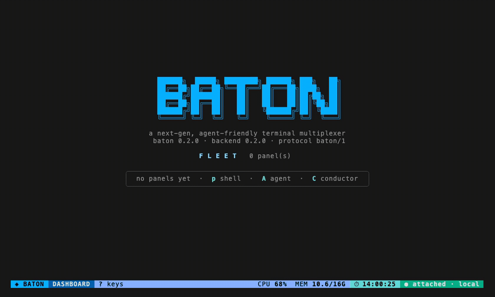
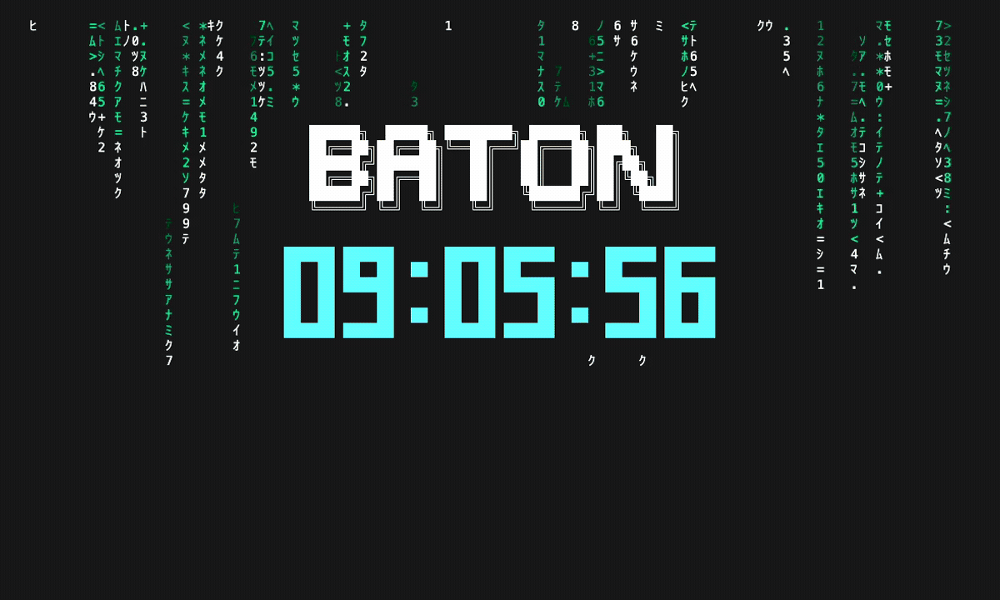

# Baton

> An extensible, agent-friendly terminal multiplexer.

[](https://github.com/cmj0121/baton/actions/workflows/ci.yml)
[](https://codecov.io/gh/cmj0121/baton)

**English** · [繁體中文](README.zh-TW.md)

Running a handful of AI coding agents at once? It gets messy fast — windows to juggle, sessions scattered across tabs, and
no single place to see who's working, who's stuck, and who's waiting on you.

Baton is to AI agents what tmux is to shells. It gives you **one keyboard-driven cockpit**: a live dashboard of every
agent, grouped into the tasks they belong to, any one a keystroke away.

You hold the baton. The agents play. You conduct. 🎼



_Spawn panels, zoom into one to drive it, group two into a work item — and `?` is always there for the keys._

_Clip generated from [`baton-demo.tape`](docs/assets/baton-demo.tape) — regeneration steps are in the tape header._

## Get started

Baton is a single static binary. Grab it with [Go](https://go.dev) 1.26+:

```sh
go install github.com/cmj0121/baton/cmd/baton@latest
```

…or build from a clone with `make install`. Then just run:

```sh
baton
```

Baton starts its background server and drops you on the **dashboard** — your home base. Your first minute:

1. Press **`A`** to spawn an agent (you'll pick a working directory for it).
2. Press **`enter`** to zoom in and watch it work; **`C-t d`** pops you back to the dashboard.
3. Press **`q`** to detach and walk away — everything keeps running. Come back any time with `baton`.

Lost? **`?`** always shows the keys for wherever you are.

## Concept

- **Agents, not shells.** The unit of work is a running agent, not a window to babysit.
- **Dashboard, not windows.** A live overview of everything at once, not a pile of tabs.
- **Headless core, replaceable frontends.** The brain is a background daemon; the face that renders it is swappable.

| Concept       | What it is                                                                                              |
| ------------- | ------------------------------------------------------------------------------------------------------- |
| **Panel**     | One live terminal — an _agent_ panel (an agent CLI) or a _shell_ panel.                                 |
| **Work item** | A named group of panels that belong to one task.                                                        |
| **Task**      | A brief you dispatch to an agent — tracked through its lifecycle, queued and scheduled if it must wait. |
| **Conductor** | An agent that drives the fleet for you — spawns, groups, and prompts the other panels over the socket.  |

## Views

You drive Baton through three views, moving between them with a keystroke:

- **Dashboard** — mission control. A live grid (a tree once it gets crowded) of every panel with its status and a
  preview. Here you navigate, spawn and close panels, and group them into work items.
- **Group** — a work item's live split: its panels tiled side by side, all streaming at once. The first few stream as
  live tiles; the rest fold into a single **summary tile** you can zoom into. Pin a few to keep them always-on, drive the
  focused one in place with **`i`**, or **`enter`** to drop into it.
- **Zoom** — one panel as your only terminal. Keystrokes go straight to the program; the leader **`C-t`** is how you act
  or step back out.

## Keys

Keys are **modal**: on the dashboard and in a group each action is a single key; in a zoom or interact your keystrokes
drive the program, so a Baton action is the leader **`C-t`** then the key. Press **`?`** for the full, rebindable list of
the current view, and **`C-t k`** to edit the key map.

| Where       | Key               | Does                                                |
| ----------- | ----------------- | --------------------------------------------------- |
| After `C-t` | `d` / `b`         | jump to the dashboard / back one level              |
|             | `[`               | enter scroll mode                                   |
|             | `R` / `S`         | reload config / force-restart the server            |
|             | `q`               | detach (server keeps running)                       |
| Dashboard   | `hjkl` / arrows   | move the cursor                                     |
|             | `enter`           | open / zoom the selection                           |
|             | `p` / `A` / `c`   | new shell / agent / pick-command panel              |
|             | `C`               | open the conductor (an agent that drives the fleet) |
|             | `w` / `x`         | close the selection / purge exited                  |
|             | `r`               | re-run the exited panel(s) under the focus          |
|             | `g` / `G` / `u`   | mark / group marked panels / ungroup                |
|             | `s` / `f` / `D`   | signal / find / diff the selection                  |
|             | `/`               | search every panel's output (grep the fleet)        |
|             | `T` / `Q`         | dispatch a task / manage the task queue             |
|             | `U`               | toggle the account usage/cost footer                |
| Group       | `tab`             | focus the next panel                                |
|             | `+` / `-`         | show more / fewer live tiles                        |
|             | `L`               | cycle the tile layout                               |
|             | `p` / `i`         | pin / interact with the focused panel               |
|             | `enter`           | zoom the focused panel                              |
| Zoom        | type              | drive the program directly                          |
|             | `C-t f` / `C-t g` | search the scrollback / git menu (agent)            |

See **[docs/SPEC.md](docs/SPEC.md)** for the complete, per-view key reference and the design behind every view.

## Features

Everything you'd reach for while shepherding a fleet, a keystroke away:

- **Signals** — `s` sends any signal to the selection, the focused tile, or the whole group; the picker lists the common
  ones, `o` types any name or number.
- **Find, search, copy** — `f` filters the fleet by title or group; `/` greps every panel's output at once and lists the
  hits grouped by panel — `enter` zooms the one you pick, landed on the match; `C-t f` regex-searches a panel's scrollback; scroll
  mode (`C-t [`) selects and copies over OSC52, so it works over SSH with no helper binary.
- **Diff** — `D` (or `C-t D` in a zoom) pops up the agent panel's work-tree diff — staged and unstaged at once,
  untracked included — in a master-detail overlay.
- **Git** — `C-t g` opens a git menu against the zoomed agent: diff, log, status, stage, commit, push, branch, and
  worktrees. See **[docs/GIT.md](docs/GIT.md)**.
- **Conductor & control** — `C` opens a conductor: an agent that drives the fleet for you. It spawns, groups, signals,
  and prompts the other panels over the socket — through `baton ctl` or the `baton mcp` tools — fenced so it can't wreck
  its own host. Set its goal in `$HOME/.baton/CONDUCTOR.md`. See **[docs/CONTROL.md](docs/CONTROL.md)**.
- **Tasks & the queue** — `T` dispatches a brief to an agent (or fans it to a whole work item), recorded on the card and
  delivered when the agent is ready. `Q` manages a persistent backlog a server-owned scheduler drains onto free agents —
  the **you → conductor → fleet** flow. A `task.pre` Lua hook can rewrite or veto a brief; `task.change` watches it.
- **Groups & summary** — `+` / `-` dial how many members stream as live tiles; the rest fold into one summary tile.
  Pinned members always stream. `L` cycles the split's **layout** — the even grid, `main-vertical`, `main-horizontal`,
  `stack`, or your own grids from `TUI.yaml`.
- **Appearance** — `$HOME/.baton/TUI.yaml` reshapes the cockpit: a colour **theme** and the group-split **layouts**,
  hot-reloaded with `C-t R`. See **[docs/TUI.md](docs/TUI.md)**.
- **Usage footer** — `U` toggles a footer readout of the day's token usage and cost (`⊙ 1.2M tok · ≈$12.34 API`). It
  reads Claude Code's own transcripts by default (works on a Pro/Max subscription) or the Anthropic Admin API with a key.
  The cost is API-equivalent, not a subscription charge. See **[docs/USAGE.md](docs/USAGE.md)**.
- **Persistence & respawn** — Baton remembers its fleet across a restart; panels come back as inert exited slots and
  `r` re-runs them from their retained spec.
- **Reload** — `C-t R` (or a `SIGHUP` to the daemon) hot-reloads config without restarting the fleet.
- **Mouse** — off by default so your terminal's own selection stays available; toggle it in the key map to scroll and
  select with the wheel.

## Screensaver

Walk away and let it sit. After a few idle minutes — or on the hidden `C-t E` — the cockpit drops into a full-screen
Matrix rain with the **BATON** wordmark and a big clock floating in the middle. It's a frontend-only takeover: nothing is
sent to the server, and any key or click brings your view straight back.



_Clip generated from [`baton-screensaver.tape`](docs/assets/baton-screensaver.tape) — regeneration steps are in the tape header._

## Architecture

A headless **baton server** (a background daemon) owns all state and every terminal. Pluggable frontends attach over a
single Unix domain socket — commands up, events down — so you detach and reattach without losing a thing.

See **[docs/SPEC.md](docs/SPEC.md)** for the full diagram and interaction model.

## Plugins

A single Lua file (`$HOME/.baton/plug-in.lua`) reshapes Baton to your workflow: react to lifecycle events (ping you when
an agent needs you, chain the next step when one finishes), drive the fleet, add your own commands, and set config — all
through one `baton` object. See **[docs/PLUGIN.md](docs/PLUGIN.md)**.

## Documentation

- **[docs/SPEC.md](docs/SPEC.md)** — the full specification: views, the panel lifecycle, work items, signals, diff,
  persistence, the per-view key reference, and the architecture diagram.
- **[docs/TUI.md](docs/TUI.md)** — the cockpit appearance file (`$HOME/.baton/TUI.yaml`): the colour theme and the
  group-split layouts (presets and custom grids).
- **[docs/GIT.md](docs/GIT.md)** — the git menu: every op, the commit-editor flow, worktrees, and the config.
- **[docs/USAGE.md](docs/USAGE.md)** — the account usage footer: the local and Admin-API sources, config, and caveats.
- **[docs/PLUGIN.md](docs/PLUGIN.md)** — the Lua plugin API: the `baton` object, events, commands, and config.
- **[docs/CONTROL.md](docs/CONTROL.md)** — driving the fleet by agent: the conductor, the `baton ctl` CLI, the
  `baton mcp` tools, and the guardrails.

## DDD (Dream-Driven Development)

This project follows DDD (dream-driven development): every feature is built from what I dream of and need.
