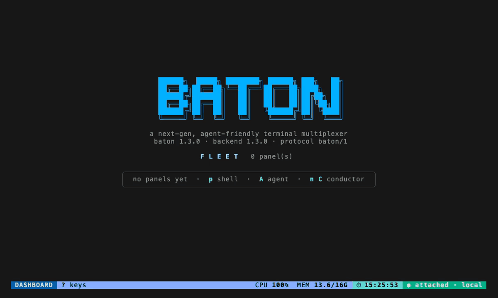
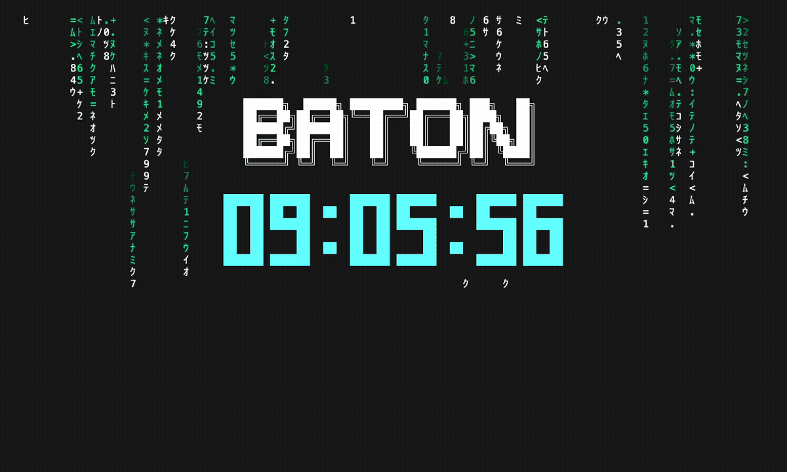

# Baton

> Ein erweiterbarer, agentenfreundlicher Terminal-Multiplexer.

[](https://github.com/cmj0121/baton/actions/workflows/ci.yml)
[](https://codecov.io/gh/cmj0121/baton)

[English](../README.md) · [繁體中文](README.zh-TW.md) · [日本語](README.ja.md) · [한국어](README.ko.md) ·
[Français](README.fr.md) · **Deutsch** · [Español](README.es.md)

Mehrere AI-Coding-Agents gleichzeitig am Laufen? Das wird schnell unübersichtlich — Fenster, die du jonglieren musst,
über Tabs verstreute Sessions, und keine einzige Stelle, an der du siehst, wer arbeitet, wer feststeckt und wer auf dich wartet.

Baton ist für AI-Agents das, was tmux für Shells ist. Es gibt dir **ein einziges, tastaturgesteuertes Cockpit**: ein
Live-Dashboard aller Agents, gruppiert nach den Aufgaben, zu denen sie gehören — jeder nur einen Tastendruck entfernt.

Du hältst den Taktstock. Die Agents spielen. Du dirigierst. 🎼



_Panels starten, in eines hineinzoomen, um es zu steuern, zwei zu einem Work Item gruppieren, den Conductor mit `C` und
die Global Shell mit `H` aufrufen — und `?` ist immer da für die Tasten._

_Der Clip wurde aus [`baton-demo.tape`](assets/baton-demo.tape) erzeugt — die Schritte zur Neuaufnahme stehen im Kopf
der Tape-Datei. Das Agent-CLI des Conductors ist ein Platzhalter ([`demo-agent.sh`](assets/demo-agent.sh)), damit der
Clip auf jeder Maschine gleich aufgezeichnet wird; die Flotte, die er über den Socket steuert, ist echt._

## Erste Schritte

Baton ist eine einzelne, statisch gelinkte Binärdatei. Unter macOS holst du sie dir mit [Homebrew](https://brew.sh):

```sh
brew install cmj0121/tap/baton
```

Unter Linux genügt eine Zeile:

```sh
curl -fsSL https://raw.githubusercontent.com/cmj0121/baton/main/scripts/install.sh | sh
```

… oder, auf jeder Plattform, holst du sie dir mit [Go](https://go.dev) 1.26+:

```sh
go install github.com/cmj0121/baton/cmd/baton@latest
```

… oder du baust sie aus einem Clone mit `make install`. Dann einfach ausführen:

```sh
baton
```

Baton startet seinen Hintergrund-Server und setzt dich auf dem **Dashboard** ab — deiner Heimatbasis. Deine erste Minute:

1. Drücke **`A`**, um einen Agent zu starten (du wählst dabei ein Arbeitsverzeichnis für ihn aus).
2. Drücke **`enter`**, um hineinzuzoomen und ihm bei der Arbeit zuzusehen; **`C-t d`** bringt dich zurück zum Dashboard.
3. Drücke **`q`**, um dich abzukoppeln und wegzugehen — alles läuft weiter. Komm jederzeit mit `baton` zurück.

Verirrt? **`?`** zeigt dir immer die Tasten für die Stelle, an der du gerade bist.

## Konzept

- **Agents, keine Shells.** Die Arbeitseinheit ist ein laufender Agent, kein Fenster, das du beaufsichtigen musst.
- **Dashboard, keine Fenster.** Eine Live-Übersicht über alles auf einmal, statt eines Stapels von Tabs.
- **Headless-Kern, austauschbare Frontends.** Das Gehirn ist ein Hintergrund-Daemon; das Gesicht, das es darstellt, ist austauschbar.

| Konzept          | Was es ist                                                                                                                                      |
| ---------------- | ----------------------------------------------------------------------------------------------------------------------------------------------- |
| **Panel**        | Ein Live-Terminal — ein _agent_-Panel (ein Agent-CLI) oder ein _shell_-Panel.                                                                   |
| **Work item**    | Eine benannte Gruppe von Panels, die zu einer Aufgabe gehören.                                                                                  |
| **Task**         | Ein Auftrag, den du an einen Agent schickst — über seinen Lebenszyklus verfolgt, eingereiht und eingeplant, wenn er warten muss.                |
| **Conductor**    | Ein Agent, der die Flotte für dich steuert — er startet, gruppiert und promptet die anderen Panels über den Socket.                             |
| **Global shell** | Eine einzelne, schlichte Host-Shell, die der Server in `$HOME` hält, immer einen Tastendruck entfernt — eine Heimatbasis, kein Flottensteuerer. |

## Ansichten

Du steuerst Baton über drei Ansichten und wechselst mit einem Tastendruck zwischen ihnen:

- **Dashboard** — die Einsatzzentrale. Ein Live-Raster (ein Baum, sobald es voll wird) aller Panels mit Status und
  Vorschau. Hier navigierst du, startest und schließt Panels und gruppierst sie zu Work Items.
- **Gruppe (Group)** — die Live-Aufteilung eines Work Items: seine Panels nebeneinander gekachelt, alle gleichzeitig
  streamend. Die ersten paar streamen als Live-Kacheln; der Rest klappt in eine einzelne **Zusammenfassungs-Kachel**
  zusammen, in die du hineinzoomen kannst. Pinne ein paar an, damit sie immer laufen, steuere die fokussierte an Ort und
  Stelle mit **`i`**, oder springe mit **`enter`** hinein.
- **Zoom** — ein Panel als dein einziges Terminal. Tastendrücke gehen direkt an das Programm; über den Leader **`C-t`**
  handelst du oder steigst wieder aus.

## Tasten

Die Tasten sind **modal**: auf dem Dashboard und in einer Gruppe ist jede Aktion eine einzelne Taste; im Zoom oder beim
Interagieren steuern deine Tastendrücke das Programm, eine Baton-Aktion ist also der Leader **`C-t`** und dann die
Taste. Drücke **`?`** für die vollständige, neu belegbare Liste der aktuellen Ansicht und **`C-t k`**, um die
Tastenbelegung zu bearbeiten.

| Where       | Taste             | Wirkung                                                           |
| ----------- | ----------------- | ----------------------------------------------------------------- |
| After `C-t` | `d` / `b`         | zum Dashboard springen / eine Ebene zurück                        |
|             | `[`               | in den Scroll-Modus wechseln                                      |
|             | `R` / `S`         | Konfiguration neu laden / Server-Neustart erzwingen               |
|             | `q`               | abkoppeln (der Server läuft weiter)                               |
| Dashboard   | `hjkl` / Pfeile   | den Cursor bewegen                                                |
|             | `enter`           | die Auswahl öffnen / hineinzoomen                                 |
|             | `p` / `A` / `c`   | neues shell- / agent- / Befehlsauswahl-Panel                      |
|             | `C`               | den Conductor öffnen (ein Agent, der die Flotte steuert)          |
|             | `H`               | die Global Shell öffnen (eine Host-Shell in `$HOME`)              |
|             | `w` / `x`         | die Auswahl schließen / Beendete entfernen                        |
|             | `r`               | die beendeten Panels unter dem Fokus erneut ausführen             |
|             | `g` / `G` / `u`   | markieren / markierte Panels gruppieren / Gruppierung aufheben    |
|             | `s` / `f` / `D`   | der Auswahl ein Signal senden / sie finden / diffen               |
|             | `/`               | die Ausgabe jedes Panels durchsuchen (die Flotte greppen)         |
|             | `T` / `Q`         | eine Task vergeben / die Task-Warteschlange verwalten             |
|             | `U`               | Nutzungs-Fußzeile durchschalten: aus / Abrechnungsfenster / Panel |
|             | `K`               | die Tastenanzeige in der Fußzeile umschalten                      |
| Group       | `tab`             | das nächste Panel fokussieren                                     |
|             | `+` / `-`         | mehr / weniger Live-Kacheln zeigen                                |
|             | `L`               | das Kachel-Layout durchschalten                                   |
|             | `p` / `i`         | das fokussierte Panel anpinnen / damit interagieren               |
|             | `enter`           | das fokussierte Panel zoomen                                      |
| Zoom        | tippen            | das Programm direkt steuern                                       |
|             | `C-t f` / `C-t g` | den Scrollback durchsuchen / Git-Menü (agent)                     |

Die vollständige Tastenreferenz pro Ansicht und die Gestaltung hinter jeder Ansicht stehen in **[docs/SPEC.md](SPEC.md)**.

## Funktionen

Alles, wonach du beim Hüten einer Flotte greifen würdest, nur einen Tastendruck entfernt:

- **Signale** — `s` sendet ein beliebiges Signal an die Auswahl, die fokussierte Kachel oder die ganze Gruppe; der
  Picker listet die gängigen auf, mit `o` tippst du einen beliebigen Namen oder eine Nummer.
- **Finden, Suchen, Kopieren** — `f` filtert die Flotte nach Titel oder Gruppe; `/` greppt die Ausgabe aller Panels auf
  einmal und listet die Treffer nach Panel gruppiert — `enter` zoomt den ausgewählten, direkt auf dem Treffer gelandet; `C-t f`
  durchsucht den Scrollback eines Panels per Regex; der Scroll-Modus (`C-t [`) markiert und kopiert über OSC52, das
  funktioniert also auch über SSH ohne Hilfsprogramm.
- **Diff** — `D` (oder `C-t D` im Zoom) blendet den Work-Tree-Diff des Agent-Panels ein — gestaged und ungestaged auf
  einmal, unversionierte Dateien inklusive — in einem Master-Detail-Overlay.
- **Git** — `C-t g` öffnet ein Git-Menü für den gezoomten Agent: diff, log, status, stage, commit, push, branch und
  worktrees. Siehe **[docs/GIT.md](GIT.md)**.
- **Conductor & Steuerung** — `C` öffnet einen Conductor: einen Agent, der die Flotte für dich steuert. Er startet,
  gruppiert, signalisiert und promptet die anderen Panels über den Socket — via `baton ctl` oder die `baton mcp`-Tools —
  eingezäunt, damit er seinen eigenen Host nicht zerlegen kann. Sein Ziel setzt du in `$HOME/.baton/CONDUCTOR.md`.
  Siehe **[docs/CONTROL.md](CONTROL.md)**.
- **Global shell** — `H` öffnet die Global Shell: eine einzelne, schlichte Host-Shell, die der Server in `$HOME` hält,
  immer einen Tastendruck entfernt. Wie der Conductor ist sie eine Markierung in der FLEET-Überschrift statt einer Karte,
  und der Server hält genau eine — sie überlebt einen Neustart als toter Slot, den du mit `r` erneut ausführst. Anders
  als der Conductor steuert sie nichts: keine eingegrenzte Rolle, kein verwalteter Workspace. (Zu unterscheiden von der
  schwebenden **scratch**-Shell `C-t ~`, die flüchtig ist und beim Abkoppeln stirbt.)
- **Tasks & die Warteschlange** — `T` schickt einen Auftrag an einen Agent (oder verteilt ihn an ein ganzes Work Item),
  auf der Karte vermerkt und zugestellt, sobald der Agent bereit ist. `Q` verwaltet ein persistentes Backlog, das ein
  servereigener Scheduler an freie Agents abarbeitet — der Fluss **du → Conductor → Flotte**. Ein `task.pre`-Lua-Hook
  kann einen Auftrag umschreiben oder ablehnen; `task.change` beobachtet ihn.
- **Gruppen & Zusammenfassung** — `+` / `-` regeln, wie viele Mitglieder als Live-Kacheln streamen; der Rest klappt in
  eine Zusammenfassungs-Kachel zusammen. Angepinnte Mitglieder streamen immer. `L` schaltet das **Layout** der
  Aufteilung durch — das gleichmäßige Raster, `main-vertical`, `main-horizontal`, `stack` oder deine eigenen Raster aus
  `TUI.yaml`.
- **Ressourcenlimits** — begrenze, was ein Panel verbrauchen darf — CPU, Speicher, Prozesse — und halte seinen
  **gesamten Prozessbaum** daran, damit ein außer Kontrolle geratener Build nicht die ganze Maschine mitreißt. Eine
  flottenweite Untergrenze und Overrides pro Agent setzt du in der Konfiguration oder unter `C-t P`; `C-t R` wendet sie
  auf die laufende Flotte an. Unter Linux mit cgroup v2 durchgesetzt — und das Panel sagt klar, wenn ein Host sie nicht
  durchsetzen kann. Siehe **[docs/LIMITS.md](LIMITS.md)**.
- **Erscheinungsbild** — `$HOME/.baton/TUI.yaml` formt das Cockpit um: ein Farb-**Theme** und die **Layouts** der
  Gruppenaufteilung, per `C-t R` heiß neu geladen. Siehe **[docs/TUI.md](TUI.md)**.
- **Nutzungs-Fußzeile** — `U` schaltet eine Fußzeile mit dem Tokenverbrauch und den Kosten des Tages um
  (`⊙ 1.2M tok · ≈$12.34 API`). Sie liest standardmäßig die Transcripts von Claude Code (funktioniert mit einem
  Pro/Max-Abo) oder mit einem Key die Anthropic Admin API. Die Kosten sind API-äquivalent, keine Abo-Gebühr.
  Siehe **[docs/USAGE.md](USAGE.md)**.
- **Persistenz & Respawn** — Baton merkt sich seine Flotte über einen Neustart hinweg; Panels kommen als inaktive,
  beendete Slots zurück, und `r` führt sie aus ihrer aufbewahrten Spezifikation erneut aus.
- **Neuladen** — `C-t R` (oder ein `SIGHUP` an den Daemon) lädt die Konfiguration heiß neu, ohne die Flotte neu zu starten.
- **Maus** — standardmäßig aus, damit die eigene Textauswahl deines Terminals verfügbar bleibt; schalte sie in der
  Tastenbelegung ein, um mit dem Rad zu scrollen und zu markieren.
- **Sprache** — die Tastenliste unter `?` und die Tastenbelegung unter `C-t k` lesen sich auf Englisch oder 繁體中文.
  Setze `settings.language`, schalte sie live in der Tastenbelegung durch, oder lass einfach dein `$LANG` entscheiden.
  Siehe **[docs/TUI.md](TUI.md#language)**.

## Bildschirmschoner

Geh weg und lass es einfach laufen. Nach ein paar Minuten Leerlauf — oder auf das versteckte `C-t E` hin — fällt das
Cockpit in einen bildschirmfüllenden Matrix-Regen mit dem **BATON**-Schriftzug und einer großen Uhr, die in der Mitte
schwebt. Es ist eine reine Frontend-Übernahme: Nichts wird an den Server geschickt, und jede Taste oder jeder Klick holt
deine Ansicht sofort zurück.



_Der Clip wurde aus [`baton-screensaver.tape`](assets/baton-screensaver.tape) erzeugt — die Schritte zur Neuaufnahme stehen im Kopf der Tape-Datei._

## Architektur

Ein headless **baton server** (ein Hintergrund-Daemon) besitzt den gesamten Zustand und jedes Terminal. Austauschbare
Frontends verbinden sich über einen einzigen Unix-Domain-Socket — Befehle hinauf, Events hinab — sodass du dich
abkoppeln und wieder verbinden kannst, ohne etwas zu verlieren.

Das vollständige Diagramm und das Interaktionsmodell stehen in **[docs/SPEC.md](SPEC.md)**.

## Plugins

Eine einzige Lua-Datei (`$HOME/.baton/plug-in.lua`) formt Baton auf deinen Workflow um: auf Lebenszyklus-Events
reagieren (dich anpingen, wenn ein Agent dich braucht, den nächsten Schritt anhängen, wenn einer fertig ist), die Flotte
steuern, eigene Befehle hinzufügen und Konfiguration setzen — alles über ein einziges `baton`-Objekt.
Siehe **[docs/PLUGIN.md](PLUGIN.md)**.

## Dokumentation

- **[docs/SPEC.md](SPEC.md)** — die vollständige Spezifikation: Ansichten, der Panel-Lebenszyklus, Work Items, Signale,
  Diff, Persistenz, die Tastenreferenz pro Ansicht und das Architekturdiagramm.
- **[docs/TUI.md](TUI.md)** — die Datei für das Erscheinungsbild des Cockpits (`$HOME/.baton/TUI.yaml`): das Farb-Theme
  und die Layouts der Gruppenaufteilung (Presets und eigene Raster).
- **[docs/LIMITS.md](LIMITS.md)** — Ressourcenlimits: die Konfiguration, die zwei Ebenen, das Hot Reload und wo sie
  tatsächlich durchgesetzt werden.
- **[docs/RESTART.md](RESTART.md)** — die Neustart-Richtlinie: was als Fehler zählt und was nicht, Backoff und Limit,
  und warum es kein `always` gibt.
- **[docs/GIT.md](GIT.md)** — das Git-Menü: jede Operation, der Ablauf im Commit-Editor, Worktrees und die Konfiguration.
- **[docs/USAGE.md](USAGE.md)** — die Fußzeile zur Kontonutzung: die lokale Quelle und die Admin-API-Quelle, die
  Konfiguration und die Vorbehalte.
- **[docs/PLUGIN.md](PLUGIN.md)** — die Lua-Plugin-API: das `baton`-Objekt, Events, Befehle und Konfiguration.
- **[docs/CONTROL.md](CONTROL.md)** — die Flotte per Agent steuern: der Conductor, das `baton ctl`-CLI, die
  `baton mcp`-Tools und die Leitplanken.

## DDD (Dream-Driven Development)

Dieses Projekt folgt DDD (Dream-Driven Development): Jedes Feature entsteht aus dem, was ich mir erträume und brauche.
